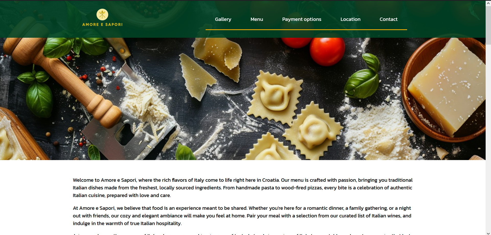
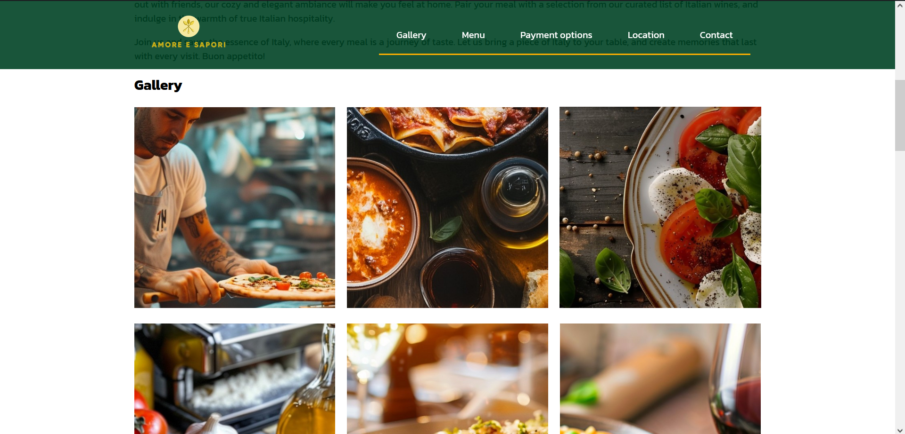
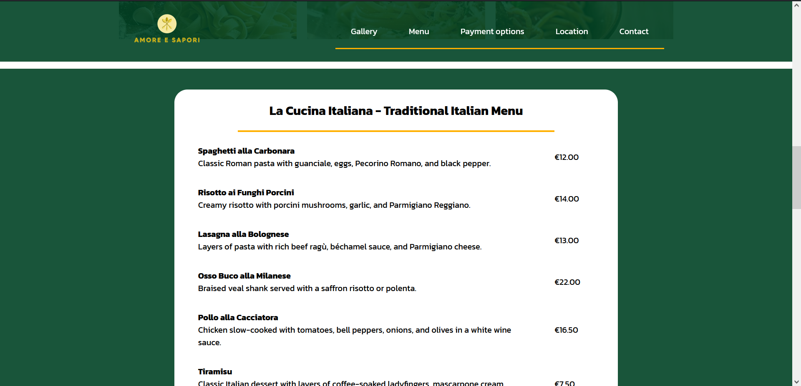
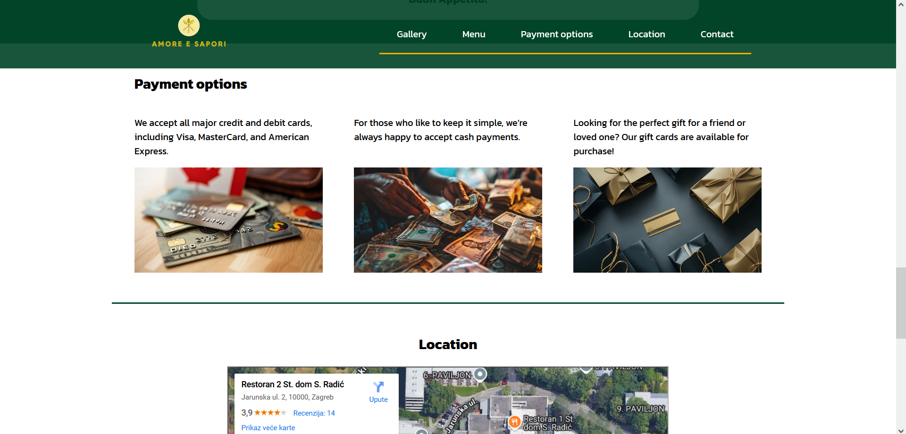
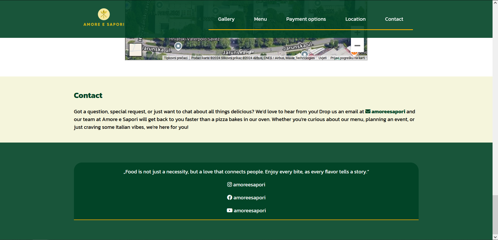

# 🍝 Amore e Sapori - Italian Restaurant Website

Welcome to **Amore e Sapori**, a captivating website for an imaginary Italian restaurant where every dish is a celebration of authentic Italian flavors. This project highlights a responsive design, elegant UI, and a seamless user experience for showcasing a restaurant's offerings.

---

## 🌟 Features

- **Introduction**: A welcoming introduction to the restaurant's ambiance and values.
- **Gallery**: A visual feast showcasing the restaurant's dishes and atmosphere.
- **Restaurant Menu**: A detailed list of traditional Italian dishes, complete with descriptions and prices.
- **Payment Options**: Information on accepted payment methods, including credit cards, cash, and gift cards.
- **Location**: An embedded Google Map for easy navigation.
- **Contact Section**: A friendly contact form and social media links for inquiries and engagement.

---

## 🛠️ Technologies Used

- **HTML5**: For structuring the content.
- **CSS3**: For styling and layout design.
- **JavaScript**: For interactivity and dynamic features.
- **Google Fonts**: To enhance typography.
- **Font Awesome**: For modern icons.
- **SimpleLightbox**: For creating a sleek, responsive image gallery.

---

## 📸 Screenshots

---

## 📄 Future Enhancements

- Add an online reservation system.
- Implement a backend for dynamic menu updates.
- Integrate customer reviews and ratings.
- Expand the gallery with video content.

---

## 🤝 Contributions

Contributions are welcome! Feel free to fork this repository, make improvements, and submit a pull request.
